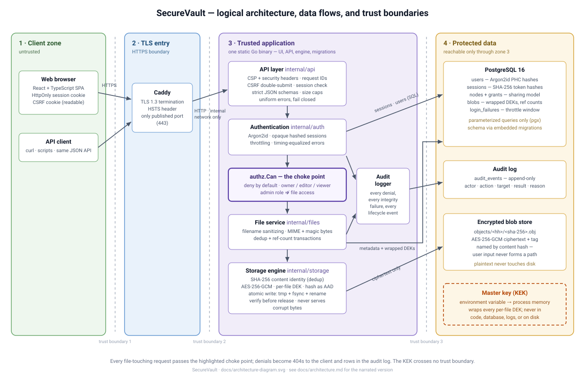

# Architecture

This document explains how SecureVault is put together and — more
importantly — *why*. Every section ends with the reasoning a reviewer or
grader would probe, so any team member can defend any component
(proposal §10).

## 1. Trust zones and boundaries

The deployment mirrors the proposal's four zones (§5.1, Figure 1):



*Report-ready versions: [architecture-diagram.svg](architecture-diagram.svg)
(vector, embeds crisply in Word/Docs) and
[architecture-diagram.png](architecture-diagram.png) (raster fallback).
The ASCII rendering below carries the same structure for terminal readers:*

```
┌─ Zone 1: Untrusted client ──────────────────────────────────────────┐
│  Browser (React SPA) / any HTTP client                              │
│  Holds: session cookie (HttpOnly), CSRF cookie (readable)           │
└──────────────────────────┬──────────────────────────────────────────┘
                           │ HTTPS only                    ── boundary 1
┌─ Zone 2: TLS entry ──────▼──────────────────────────────────────────┐
│  Caddy (or Coolify's proxy): TLS 1.3 termination, nothing else      │
│  (deploy/Caddyfile — HSTS and all headers come from the app)        │
└──────────────────────────┬──────────────────────────────────────────┘
                           │ private Docker network        ── boundary 2
┌─ Zone 3: Trusted application ─▼─────────────────────────────────────┐
│  One Go binary (cmd/server):                                        │
│    api        HTTP surface, CSRF, security headers, strict schemas  │
│    auth       Argon2id, sessions, throttling                        │
│    authz      THE authorization choke point (deny by default)       │
│    files      upload/download/share/delete orchestration            │
│    storage    content-addressed encrypted object store              │
│    audit      append-only event writer                              │
└───────┬──────────────────────────────┬──────────────────────────────┘
        │ parameterized SQL (pgx)      │ ciphertext only  ── boundary 3
┌─ Zone 4: Protected data ▼────────────▼──────────────────────────────┐
│  PostgreSQL: users, hashed sessions, nodes, grants,                 │
│              wrapped DEKs, ref counts, audit_events                 │
│  Blob volume: AES-256-GCM ciphertext objects named by content hash  │
│  (master key crosses NO boundary: env var → process memory only)    │
└─────────────────────────────────────────────────────────────────────┘
```

Boundary rules the code enforces:

- The browser never receives a filesystem path, a content hash it didn't
  upload, or an internal error string.
- Zone 3 is the only writer to Zone 4. The blob directory contains only
  ciphertext; the database contains only wrapped keys and hashed tokens, so
  neither store alone (nor both together, without the KEK) yields plaintext.
- The master key exists in exactly one place at runtime: process memory,
  loaded from `SECUREVAULT_MASTER_KEY` at startup and validated fail-closed
  (`internal/config`).

## 2. Component map

| Package | Responsibility | Depends on |
|---|---|---|
| `cmd/server` | wiring: config → pool → migrations → services → HTTP server | everything below |
| `internal/config` | environment parsing, master-key validation, fail-closed startup | — |
| `internal/database` | pgx pool; embedded SQL migration runner (advisory-locked, transactional) | — |
| `internal/storage` | content-addressed encrypted store; standalone — **no database, no HTTP imports** | — |
| `internal/auth` | passwords, sessions, throttling, credential lifecycle | database, audit |
| `internal/authz` | `Can(user, acl, action)` — pure function, the only role logic in the codebase | auth (types only) |
| `internal/files` | transactions joining metadata (Postgres) with objects (storage); every op authorizes + audits | storage, authz, audit |
| `internal/api` | routes, middleware (request-id, recovery, headers, session, CSRF), strict decoding, uniform errors | auth, files, audit |
| `internal/audit` | append-only event inserts; never fails the guarded operation, never logs secrets | database |
| `web/` | React + TypeScript SPA; embedded via `embed_on.go` (build tag `embedui`) | — |

The dependency arrows only point downward — `storage` and `authz` are leaf
packages, which is what makes them independently testable (proposal §5.4:
storage engine built and tested before any web code existed).

## 3. Database schema

Defined in `internal/database/migrations/0001_init.sql`; migrations are
embedded in the binary and applied automatically (see §6.4).

| Table | Purpose | Security-relevant columns |
|---|---|---|
| `users` | accounts | `password_hash` — Argon2id PHC string; `role` ∈ {user, admin} |
| `sessions` | server-side sessions | `token_hash` — SHA-256 of the opaque cookie token; `expires_at` |
| `login_failures` | throttling window | `key` — `u:<username>` or `ip:<addr>`; pruned opportunistically |
| `blobs` | one row per unique content | `hash` (PK) — SHA-256 of *plaintext*; `wrapped_dek`; `ref_count` |
| `nodes` | user-visible files | `owner_id`, `blob_hash` (FK), `display_name` — sanitized metadata, **never a path** |
| `grants` | sharing | `(node_id, grantee_id)` PK; `role` ∈ {editor, viewer}; owners are implicit via `nodes.owner_id` |
| `audit_events` | append-only trail | actor, action, target, result ∈ {ok, denied, error}, reason, request_id |
| `schema_version` | migration bookkeeping | one row per applied migration |

Design notes:

- `blobs.hash` is the hash of the **plaintext**, not the ciphertext. That is
  what makes deduplication work across users and what the read path
  re-verifies after decryption.
- A `nodes` row without a `blobs` row is impossible (FK); the write ordering
  in §5 makes the converse (an orphan object file) harmless.
- Owners never appear in `grants` — `authz.Can` treats ownership specially,
  so a corrupted grant row can never demote or replace an owner.

## 4. The storage engine (`internal/storage`)

### Object format and layout

```
data/
├── objects/<first-2-hex>/<64-hex>.obj     ← path derived ONLY from the hash
└── tmp/staged-*                           ← same filesystem → atomic rename

.obj file = "SVL1" ‖ nonce (12 bytes) ‖ AES-256-GCM ciphertext+tag
```

- Per object: fresh random 32-byte DEK and 96-bit nonce.
- The DEK is wrapped (AES-256-GCM under the KEK) and stored in
  `blobs.wrapped_dek` — never on disk next to the object.
- **The content hash is the associated data (AAD) for both encryptions.**

### Write path: `Stage` → `Commit` / `Abort`

```
Stage(reader, limit):
  read at most limit+1 bytes           ← size enforced while receiving
  hash  = SHA-256(plaintext)           ← the object's identity, forever
  dek   = random 32 bytes
  seal  = AES-GCM(dek, nonce, plaintext, aad=hash)
  write "SVL1"+nonce+seal to tmp/, fsync
  return {Hash, Size, WrappedDEK}

caller (files.Upload), inside one Postgres transaction:
  SELECT ref_count FROM blobs WHERE hash = $1 FOR UPDATE
  row exists   → ref_count++            ; staged.Abort()   (dedup)
  row missing  → INSERT blobs (ref 1)   ; staged.Commit()  (fsync + rename + dir fsync)
  INSERT nodes (owner, blob_hash, name…)
  COMMIT
```

### Read path: verify before release

`Open(hash, wrappedDEK)` releases plaintext only after **three** independent
checks pass, in order: (1) DEK unwrap authenticates (KEK + AAD), (2) the
content GCM tag authenticates (DEK + AAD), (3) the decrypted plaintext
re-hashes to the requested address (constant-time compare). Any failure →
`ErrCorrupt`, zero plaintext bytes escape, and the caller audits
`integrity_failure`.

### Why it is built this way

**Two-phase writes / crash consistency.** The object file is renamed into
place *before* the database transaction commits. So the only possible crash
artifact is an **orphan file with no metadata row** — invisible to every
API, and atomically replaced the next time the same content is uploaded
(`TestCommitReplacesOrphan`). The dangerous inverse — a metadata row whose
object is missing or partial — cannot occur. Deletion mirrors this:
metadata first, unlink after commit, so again the worst case is an orphan.

**Hash as AAD.** GCM already detects modified bytes. Binding the content
address as associated data additionally defeats *relocation*: an attacker
with disk access who swaps two intact ciphertext objects (or re-points a
wrapped DEK at another object) fails authentication outright
(`TestObjectRelocationAttack`). Identity, confidentiality, and integrity
become one inseparable check.

**Reference-counted deduplication.** Identical content from different users
is one object, one wrapped DEK, many `nodes` rows. `FOR UPDATE` on the blob
row serializes concurrent uploads of the same new content; the loser of the
`INSERT` race retries once and takes the dedup path. Deletion decrements
under the same lock and removes the object only at zero — one user deleting
"their" file can never affect another's (`TestDeduplication`, asserted at
both the storage and HTTP layers).

**Known trade-off: in-memory buffering.** Go's stdlib GCM is one-shot, so
within the configured limit (`MAX_UPLOAD_BYTES`, default 25 MiB) content is
buffered in memory during encryption and verification. This is bounded and
deliberate: the proposal excludes chunked/resumable uploads (§4.2), and a
streaming AEAD construction would add exactly the kind of hand-rolled
cryptographic complexity the project is scoped to avoid. State this
limitation in the report rather than hiding it.

## 5. Request lifecycles

### Upload (POST /api/files)

1. **Session** middleware resolves the cookie → user (401 otherwise).
2. **CSRF** double-submit check (403 otherwise).
3. `MaxBytesReader` caps the whole request; the multipart reader streams the
   `file` part without buffering to disk.
4. **Validation** (`files.ValidateContent`): declared MIME vs. magic-byte
   signature of the first 512 bytes; mismatch → 400 + audit `type_mismatch`.
   Filename sanitized to display metadata (`SanitizeFilename`).
5. **Stage** (hash, encrypt, temp file) — size violations surface here too.
6. **Transaction**: dedup-or-insert as in §4; node row created; commit.
7. **Audit** `file.upload ok`; response is the node's metadata JSON.

### Download (GET /api/files/{id}/download)

1. Session check; UUID validated by regex before touching the database.
2. `files.authorize` loads the node + grants and evaluates
   `authz.Can(user, acl, download)`. Denial and non-existence both → 404
   (no resource enumeration) + audit `denied`.
3. `storage.Open` performs the three-step verification of §4.
4. Response: `Content-Disposition: attachment` (RFC 2183-encoded filename),
   `X-Content-Type-Options: nosniff`, `Cache-Control: no-store` — downloads
   are files, never renderable pages, so a stored-XSS payload in a filename
   or file body has nowhere to execute.
5. Audit `file.download ok` (or `error/integrity_failure`).

## 6. Cross-cutting decisions and rationale

### 6.1 One authorization choke point

`authz.Can` is a *pure function* over `(user, ACL, action)` — no I/O, no
context. Every file-touching handler routes through
`files.authorize → authz.Can`; the admin gate is a separate
`CanAdministrate` that deliberately conveys **no** path to file content
(proposal §4.3: admins administer accounts and read audit logs; they cannot
read files through the sharing model — `TestEndpointRoleMatrix` proves an
admin gets the same 404s as a stranger). Purity is what makes the exhaustive
matrix test (`TestAuthorizationMatrix`) possible: every role × action cell
is written out and asserted.

### 6.2 Sessions: opaque, hashed, rotated

Tokens are 256-bit random values; the database stores only their SHA-256
(`TestSessionHygiene` proves the cookie value never appears in the DB). A
database leak therefore yields nothing replayable. Rotation happens on every
login, and a password change revokes *all* sessions and issues a fresh one.
Cookies: `HttpOnly` (no script access), `SameSite=Strict` (no cross-site
sends), `Secure` outside dev mode.

### 6.3 CSRF: double-submit with a twist of SameSite

Two independent layers: `SameSite=Strict` on the session cookie stops the
browser attaching it to cross-site requests at all, and the double-submit
check (`X-CSRF-Token` header must equal the `sv_csrf` cookie, constant-time)
stops anything that slips past — a cross-site attacker can neither read the
cookie nor set the header. GET endpoints are exempt by design and therefore
must stay side-effect-free.

### 6.4 Embedded SQL migrations

Numbered `.sql` files compiled into the binary and applied at startup, each
in its own transaction, under a `pg_advisory_lock`. Rationale: zero extra
tooling for a four-person team (run the binary → schema is correct), the
single-binary claim stays honest, Postgres's transactional DDL makes each
step atomic, and every schema change is a reviewable file in a PR. The
trade-off — no down-migrations — is acceptable for a short-lived project
that fixes forward; down-scripts are rarely-tested code that mostly adds
risk.

### 6.5 The single static binary

`make build` runs `pnpm build` (Vite → `web/dist/`) then
`go build -tags embedui`, embedding the UI via `//go:embed all:dist`
(`web/embed_on.go`). One process serves UI and API, so:

- security headers (CSP `default-src 'self'`, nosniff, referrer-policy,
  COOP/CORP) are set in exactly one file, `internal/api/middleware.go`;
- UI and API share an origin — no CORS, and `SameSite=Strict` just works;
- the demo artifact is bit-for-bit what CI built.

Dev builds embed nothing (`web/embed_off.go`) because development uses the
Vite dev server (see [development.md](development.md)).

### 6.6 Uniform errors and fail-closed handling

Unknown username and wrong password return byte-identical 401s, with an
Argon2id verification burned on the unknown-user path so timing does not
distinguish them (`EqualizeTiming`, `TestUniformCredentialErrors`).
Not-found and access-denied are both 404 (`TestEndpointRoleMatrix`); the
audit log — not the client — records which it was. Panics become bare 500s
via the recovery middleware; stack traces and driver errors never leave the
process (`TestMalformedInputRejected`).

### 6.7 What the design does NOT defend against

Stated openly for the report (proposal §4.2 exclusions and general threat
model honesty):

- A compromised application host: the KEK is in process memory; an attacker
  with root on Zone 3 wins. Mitigations (HSMs, KMS) are explicitly out of
  scope (§4.2.5).
- Denial of service beyond per-request limits and login throttling — no
  global rate limiting or quotas.
- Malicious content *semantics*: uploads are validated for type consistency
  and size, not scanned for malware (§4.2.4); downloads are
  attachment-only, which contains the browser-side risk.
- Traffic analysis: object sizes and access times are visible to a
  disk-level observer.
